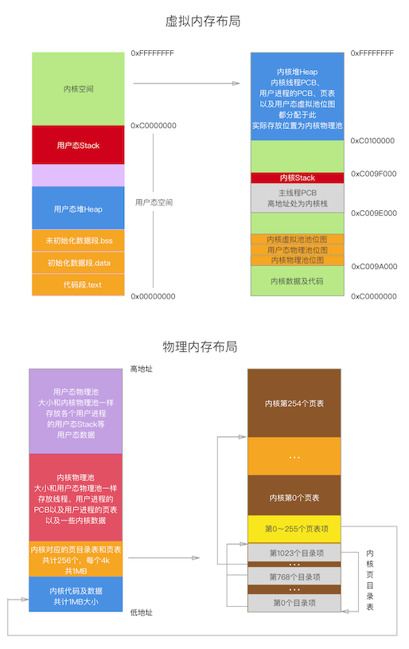
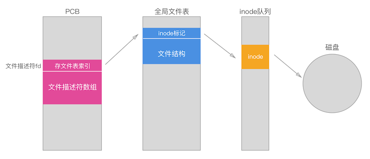

# toyOS
一个玩具OS, 32bit

思路和实现上参考了《操作系统真象还原》

最终目标是实现一个简易的可交互的Shell

__TO-DO List：__

- [x] 虚拟内存及内存管理
- [x] 内核级线程
- [x] 用户态进程
- [x] 文件系统
- [ ] 交互Shell

### 硬盘分区
一共分主次两个硬盘，系统本身安装于主盘，采用的是MBR的引导模式，MBR->Boot Loader->Kernnel的过程

`MBR`位于磁盘`LBA 0号扇区`开始的**1**个扇区内

`Boot Loader`位于磁盘`LBA 2号扇区`开始的**4**个扇区内

`Kernel`位于磁盘`LBA 9号扇区`开始的**200**个扇区内

文件系统实现在从盘。这里可能不是很合理，若是按照商业系统的逻辑应该是现实现文件系统，再在相应分区安装操作系统

### 虚拟内存及内存管理
内存分页，一页为4Kb

内存管理采用位图管理，分配内存时按大小区分，大于1024字节的直接按页分配

若是小于1024字节，则在按页分配arena的基础上，用arena中的空闲块链进行分配和控制

为了实现方便，虽然开启了分页机制，但是并没有实现内存页与磁盘上的交换功能



### 线程和进程
PCB为1页大小

线程的调度，核心本质是通过时钟中断控制ESP指针切换来切换PCB，优先级的体现在于每个线程的运行时间片的长短

进程的实现基于线程，其中TSS的选择上仿效Linux，采用单TSS备份0级栈以及0级栈指针的做法。和线程最大的不同是进程的PCB中拥有页表地址，这也正是进程和线程最大的不同，进程真正拥有自己的独立虚拟内存空间

调度上没有用什么高效的算法，直接用队列循环调度

__idle线程的实现__

idle线程的实现很简陋，第一次得到调度时，将自己阻塞让出CPU，当调度器再次执行调度时，若在ready队列中没有发现就绪的线程或进程，就唤醒idle线程，此时idle线程通过`hlt`挂起CPU，当时间片用完，CPU还没有发现有ready的进程或线程，则继续将idle线程换上CPU，此时idle又将继续把自己阻塞，然后开始重复上面的调度过程

```c
// 空载任务
static void idle(void *arg) {
    while(1) {
        thread_block(TASK_BLOCKED);
        asm volatile ("sti; hlt" : : : "memory");
    }
}
```

__进程fork__

进程的fork，先复制当前进程的PCB，然后再通过当前进程的虚拟池位图建立一个新页表，其中虚拟地址的对应和原进程中一模一样，最后伪造一个中断现场，将子进程加入到调度队列中等待调度执行。伪造的中断现场中，子进程的PCB里的eax修改成了0，代表新进程中拿到fork的返回值为0，而父进程的PCB中的eax不变，代表着子进程的pid。父进程是通过系统调用结束返回，而子进程是直接通过中断退出函数返回

__进程exec__

exec的实现，首先将elf文件从磁盘加载到内存，然后改变当前进程的PCB中的进程名，并把待执行进程所需的参数放入到约定的寄存器中，并将eip修改成elf的entry point，伪造中断现场，通过直接调用中断退出函数intr_exit来立即执行新进程。

其中ELF的Entry Point是通过自己实现一个极其简陋的CRT来实现的，其中给出了一个_start入口，并push约定的参数寄存器到3级栈中，通过call来调用外部命令的main函数来实现参数传递，详见start.s

__进程wait__

在fork且调用exec执行一个本地命令之后，为了不出现僵尸进程，父进程需要在本地wait子进程结束。

这里的实现是进入sys_wait系统调用后，遍历全进程队列，找到父进程是自己的挂起状态的进程，然后取得他pcb中的返回值，回收pcb和页目录表，并将其从调度队列中剔除。若遍历之后没发现挂起的子进程，则将自己阻塞，等待子进程唤醒。

__进程exit__

外部命令在执行期间其实是被自己造的简易CRT包裹的，简易CRT call外部命令的main，在其结束时取得他的返回值，传递给exit，然后call exit

这里的实现主要做了三件事：
1. 将自己的所有子进程过继给init进程
2. 将传入的main的返回值放入到pcb中，回收自己除了pcb和页目录表之外的所有资源（页表中对应的物理页、虚拟内存池占物理页框、关闭打开的文件）
3. 唤醒正在wait中阻塞的父进程之后，将自己阻塞

__加载外部命令并执行的整个过程__

首先外部命令的编译需要提供一个`int main(int argc, char **argv)`函数，链接的时候要带上自制版的简易CRT`start.o`

当要执行一个外部命令时，当前进程fork出一个进程，在新进程中execv，当前进程执行wait，传入一个地址等待接受子进程返回值，然后阻塞等待新进程返回。新进程在exevc中将外部命令从文件系统加载到内存，并将pcb中的相关内容修改为外部命令的信息，并修改pcb中断栈中的eip为CRT的_start入口（此时新进程已经完全将自己替换成了待执行的外部命令进程），最后使用中断退出函数`intr_exit`来伪造中断退出从而进入CRT再进入外部命令的main。当外部命令main执行结束返回时，CRT通过main返回值调用exit，在exit中将main返回值放入进程pcb的相应位置，回收除了pcb和页目录表之外的所有资源，然后唤醒父进程，阻塞子进程。父进程被唤醒后，系统调用`sys_wait`从自己挂起的子进程的pcb中拿到返回值，放入到之前传入的地址，清理子进程的pcb的页目录表，从调度队列和全局队列去除掉子进程，返回子进程pid，至此，子进程执行完毕并完全被回收。

### 文件系统
文件系统的实现模仿类Unix系统的inode

分区限定inode数量4096个，CPU按块（簇）大小操作硬盘，一块设置为一扇区，512字节。

inode共支持12个直接块和1个一级间接表，一个块为一扇区512字节，所以单文件最大支持140 * 512字节

__inode结构__


__文件系统布局__


__文件描述符与inode的对应__



* 文件权限管理没有实现
* 文件类型，只包含文件夹和普通文件，并没有对普通文件进行细分
* 文件的stat，只包含inode编号、文件大小和文件类型三个字段
* 实现了文件操作的一些基本功能，如mkdir、pwd、cd等，详见fs.h
